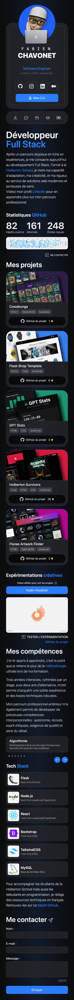

# Personal Website v2.0

## Description

This is the second version of my personal website, designed to showcase my professional skills and projects, and to provide a platform for potential employers or collaborators to get to know me better.

For this iteration, I chose to focus primarily on Tailwind CSS in order to deepen my front-end skills and build a design that better reflects my identity and expectations, as initially envisioned in the v1.0 README. This version represents a more thoughtful approach to styling, layout, and responsiveness, while still maintaining a minimalist philosophy.

That said, I am still not fully satisfied with the current result, and I am already considering a future v3.0 to further refine both the design and user experience.

## Objectives

- Confirm my knowledge of Tailwind CSS.
- Practice JavaScript for user interaction.
- Use libraries for efficiency.
- Improve front-end development skills.
- Enhance interactivity and UI/UX design.
- Create a minimalist design.
- Establish an online presence.

## Tech Stack


## File Description

| **FILE**     | **DESCRIPTION**                                     |
| :----------: | --------------------------------------------------- |
| `assets`     | Contains the resources required for the repository. |
| `index.html` | Main HTML structure for the project.                |
| `styles.css` | Styles and animations for the project.              |
| `script.js`  | Behavior script for interactivity.                  |
| `CNAME`      | Defines the custom domain name for the website.     |
| `README.md`  | The README file you are currently reading 😉.       |

## Installation & Usage

### Installation

1. Clone this repository:
    - Open your preferred Terminal.
    - Navigate to the directory where you want to clone the repository.
    - Run the following command:

```
git clone https://github.com/fchavonet/web-personal_website.git
```

2. Open the cloned repository.

3. Go to the v2.0 folder.

### Usage

1. Open the `index.html` file in your web browser.

<table align="center">
    <tr>
        <th align="center" style="text-align: center;">Desktop view</th>
        <th align="center" style="text-align: center;">Mobile view</th>
    </tr>
    <tr valign="top">
        <td align="center">
            <picture>
                
            </picture>
        </td>
        <td align="center">
            <picture>
                
            </picture>
        </td>
    </tr>
</table>

## What's Next?

- Add more projects.
- Create a better `v3.0`.

## Thanks

- A big thank you to my friends Pierre and Yoann, always available to test and provide feedback on my projects.

## Author(s)

**Fabien CHAVONET**
- GitHub: [@fchavonet](https://github.com/fchavonet)
