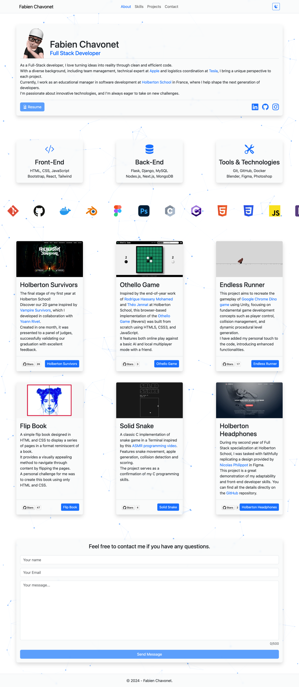
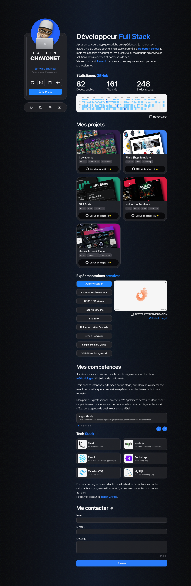
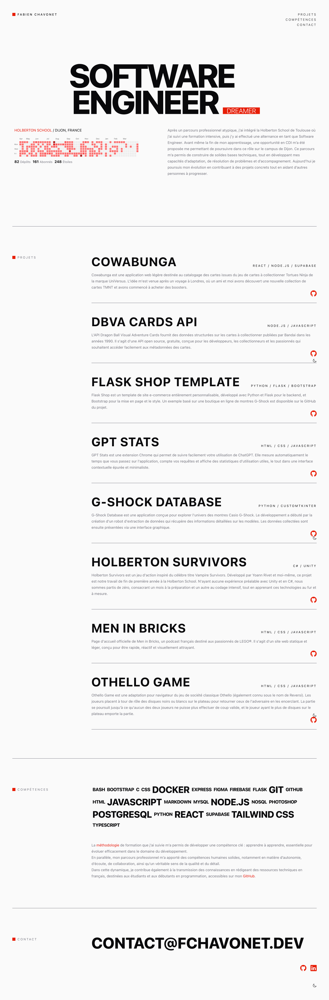

# Personal Website

## Description

This repository contains all versions of my personal website, developed progressively as part of my journey to improve my front-end development skills and refine my design approach.

Each version reflects a different stage of learning and experimentation:

- [v1.0](./v1.0/): focuses on rapid development using Bootstrap.
- [v2.0](./v2.0/): introduces a more structured design approach with Tailwind CSS.
- [v3.0](./v3.0/): emphasizes minimalism, typography, and content clarity.

Together, these iterations showcase both technical progression and evolving design thinking.

<table align="center">
    <tr>
        <th align="center">v1.0</th>
        <th align="center">v2.0</th>
        <th align="center">v3.0</th>
    </tr>
    <tr valign="top">
        <td align="center">
            
        </td>
        <td align="center">
            
        </td>
        <td align="center">
            
        </td>
    </tr>
</table>

## File Description

| **FILE**    | **DESCRIPTION**                                              |
| :---------: | ------------------------------------------------------------ |
| `v1.0`      | First version of the website (Bootstrap, rapid prototyping). |
| `v2.0`      | Second version with Tailwind CSS and improved layout/design. |
| `v3.0`      |  Third version focused on minimalism and typography.         |
| `.github`   | GitHub configuration files (workflows, templates...).        |
| `README.md` | The README file you are currently reading 😉.                |

> Each folder contains its own `README.md` file with a detailed explanation.

## Thanks

- I would like to thank all those who participated or helped to carry out those projects.

## Author(s)

**Fabien CHAVONET**
- GitHub: [@fchavonet](https://github.com/fchavonet)
